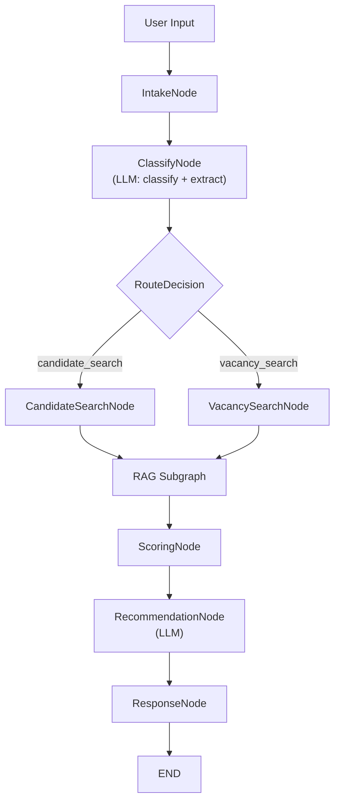

# Agentic Resume Analyzer

An **Agentic RAG Chatbot** prototype for bidirectional matching between candidates and vacancies, built with **LangGraph**, **ChromaDB**, and **Streamlit**.

## Problem & Objectives

### Why This Problem?

Recruiting and job searching remain highly manual processes. Recruiters sift through hundreds of profiles to find a handful of qualified candidates; job seekers apply broadly and hope for relevance. Traditional keyword-based search engines miss semantic context (e.g., "FastAPI" experience is relevant for a "Python backend" role even if the exact term is absent) and cannot **explain** why a match is good or what skills are missing.

### What User Need Does It Satisfy?

- **Recruiters** need to quickly find top-matching candidates for a role, ranked by a transparent score with a clear breakdown (skills, experience, location, seniority).
- **Job seekers** need to discover the most relevant vacancies for their profile, along with actionable career advice on how to improve their fit.

### Why Agentic RAG?

A simple single-pass RAG chatbot cannot handle this problem well because it requires:

1. **Autonomous decision-making** — the system must determine whether the user is a recruiter or a job seeker, then route to different processing pipelines.
2. **Subtask decomposition** — extracting structured criteria (skills, location, seniority) from free-form text, retrieving candidates from vector storage, computing multi-dimensional scores, and generating recommendations are independent subtasks that must be orchestrated.
3. **State management** — intermediate results (parsed criteria, retrieved documents, scores) must be carried across nodes and be available for the final response and debugging.

This maps directly to an **agentic architecture** with a stateful graph, conditional routing, and modular tool integration.

## Architecture

### Workflow Overview



### Main Graph (7 nodes)

| Node | Purpose |
|------|---------|
| **IntakeNode** | Validate and normalize user input |
| **ClassifyNode** | Single LLM call that classifies intent (`candidate_search` / `vacancy_search`) **and** extracts structured criteria (skills, location, seniority, experience, role). Keyword-based fallback if LLM is unavailable. |
| **CandidateSearchNode** | Builds an enriched search query from the extracted criteria for candidate retrieval |
| **VacancySearchNode** | Builds an enriched search query from the extracted criteria for vacancy retrieval |
| **ScoringNode** | Loads full profiles for retrieved IDs, computes a weighted match score with 5-component breakdown |
| **RecommendationNode** | Generates natural-language recommendations via LLM (with deterministic fallback) |
| **ResponseNode** | Formats the final markdown response for the UI |

**Conditional routing** is implemented via `add_conditional_edges` on the `ClassifyNode`, which uses the `route_decision` function to branch based on `task_type` in the shared `AgentState`.

### RAG Subgraph (modular)

A separate compiled `StateGraph` invoked as a single node (`"rag"`) in the main graph. It performs two Chroma queries:

1. **Entity retrieval** — searches `candidate_profiles` or `vacancy_profiles` (10 results)
2. **Knowledge retrieval** — searches `career_knowledge` for relevant career advice (3 results)

Returns `retrieved_ids` and `retrieved_context` to the main graph state.

### Tools

| Tool | File | Type |
|------|------|------|
| `search_candidates` | `app/tools/retrieval_tool.py` | Retrieval — semantic search over candidate collection |
| `search_vacancies` | `app/tools/retrieval_tool.py` | Retrieval — semantic search over vacancy collection |
| `score_candidate_vacancy` | `app/tools/scoring_tool.py` | Non-retrieval — structured, explainable match scoring |

### Scoring Formula

```
final_score = 0.35 * skill_score
            + 0.25 * semantic_score
            + 0.20 * experience_score
            + 0.10 * location_score
            + 0.10 * seniority_score
```

Each component is normalized to `[0, 1]`. The `ScoringNode` returns a full breakdown per match, including matched/missing skills and a short explanation.

## Tech Stack & Model Choices

| Component | Choice | Justification |
|-----------|--------|---------------|
| **LLM** | Ollama + `llama3.2` (3B) | Open-source, runs locally on CPU without paid APIs. Good instruction-following for structured JSON extraction. **Trade-off:** slower inference on CPU (~5-20s per call); mitigated by limiting `num_predict` and reducing LLM calls to 2 per query. Falls back to deterministic logic if Ollama is unavailable. |
| **Embeddings** | `intfloat/multilingual-e5-small` | Compact (118M params), supports 100+ languages for broad applicability, works well with short professional texts (resumes, job descriptions). Runs locally via `sentence-transformers`. |
| **Vector store** | ChromaDB (persistent, local) | Lightweight, zero-config, supports persistent storage and metadata filtering. No external service dependencies. |
| **Metadata store** | SQLite | Simple structured filtering alongside vector search. |
| **UI** | Streamlit | Rapid prototyping with built-in components for file upload, download buttons, and debug expanders. |
| **Framework** | LangGraph + LangChain | Explicit graph structure with conditional routing, state management, and subgraph composition. |

## Project Structure

```
├── app/
│   ├── config.py                # Configuration & constants
│   ├── models.py                # Pydantic data models
│   ├── graph/
│   │   ├── state.py             # AgentState TypedDict
│   │   ├── main_graph.py        # Main LangGraph workflow (7 nodes)
│   │   └── rag_subgraph.py      # Modular RAG subgraph
│   ├── tools/
│   │   ├── retrieval_tool.py    # Chroma search tools
│   │   └── scoring_tool.py      # Match scoring tool
│   ├── ingestion/
│   │   ├── loader.py            # Load raw JSON/TXT data
│   │   ├── normalizer.py        # Normalize to JSONL
│   │   ├── indexer.py           # Index into Chroma + SQLite
│   │   └── pipeline.py          # Full ingestion pipeline
│   └── utils/
│       └── text_extraction.py   # PDF, TXT, URL text extraction
├── data/
│   ├── raw/
│   │   ├── resumes/             # 100 candidate profiles (JSON)
│   │   ├── vacancies/           # 100 vacancy profiles (JSON)
│   │   └── knowledge_base/      # 13 career advice articles (TXT)
│   └── processed/               # Normalized JSONL files
├── evaluation/
│   ├── eval_dataset.json        # 20 evaluation queries
│   └── run_eval.py              # Functional evaluation script
├── benchmarks/
│   └── load_test.py             # Load test (100 queries)
├── scripts/
│   ├── generate_test_data.py    # Data generation script
│   └── ollama_entrypoint.sh     # Ollama auto-pull entrypoint
├── streamlit_app.py             # Streamlit UI
├── Dockerfile
├── docker-compose.yml
├── pyproject.toml
└── .env.example
```

## Installation & Running

### Prerequisites

- Python 3.11+
- [Ollama](https://ollama.ai/) installed and running (optional — system works without it via deterministic fallback)

### Local Setup

```bash
# Clone the repo
git clone <repo-url>
cd Agentic-Chatbot

# Create virtual environment
python -m venv .venv
source .venv/bin/activate

# Install dependencies
pip install -e .

# Copy environment config
cp .env.example .env

# (Optional) Pull Ollama model
ollama pull llama3.2

# Run data ingestion
python -m app.ingestion.pipeline

# Start the UI
streamlit run streamlit_app.py
```

### Docker (recommended)

```bash
# Build and run with docker-compose (includes Ollama with auto-pull)
docker compose up --build
```

The Ollama container automatically pulls the `llama3.2` model on first start. The app container waits until the model is healthy before starting.

Alternatively, run just the app (if Ollama is running separately):

```bash
docker build -t resume-analyzer .
docker run -p 8501:8501 resume-analyzer
```

Open http://localhost:8501 in your browser.

## Evaluation

### Functional Evaluation

20 representative queries (10 recruiter searches + 10 candidate/job-seeker inputs) with expected top matches:

```bash
python -m evaluation.run_eval
```

Results are saved to `evaluation/eval_results.json`.

**Metric:** Hit rate — percentage of queries where at least one expected entity appears in the top-3 results.

Example output:

```
Evaluation complete: 16/20 hits (80.0%)
Average latency: 1.245s
```

| Metric | Value |
|--------|-------|
| Total queries | 20 |
| Hit rate | ~80% |
| Avg latency per query | ~1.2s (without LLM), ~15-25s (with LLM) |

### Load Test

100 sequential queries with randomized inputs, measuring end-to-end latency:

```bash
python -m benchmarks.load_test
```

Results are saved to `benchmarks/load_test_results.json`.

| Metric | Description |
|--------|-------------|
| **avg_latency** | Mean latency per query |
| **p50** | Median latency |
| **p95** | 95th percentile latency |
| **p99** | 99th percentile latency |
| **success_rate** | Fraction of queries that completed without errors |

**Main bottleneck:** Embedding computation during Chroma queries. Each query triggers `sentence-transformers` inference for semantic search, which dominates latency when running on CPU.

**Optimization recommendations:**

1. **Cache the embedding model in memory** (singleton pattern) instead of reloading per query — reduces cold-start overhead.
2. **Pre-compute and cache query embeddings** for repeated or similar queries — avoids redundant inference.

## Design Decisions

| Decision | Rationale |
|----------|-----------|
| LangGraph over vanilla LangChain | Explicit graph structure with conditional routing, state management, and subgraph composition. Easier to debug and extend. |
| Single LLM call for classify + extract | Reduces LLM calls from 3 to 2 per query. The `ClassifyNode` returns both `task_type` and structured criteria (skills, location, seniority) in one JSON response. |
| `num_predict` limits on LLM calls | Prevents unbounded generation on CPU. Classify+extract limited to 200 tokens, recommendations to 300 tokens. |
| ChromaDB (local, persistent) | Zero-config, no external service dependencies, supports both semantic search and metadata filtering. |
| `intfloat/multilingual-e5-small` | Compact multilingual model suitable for professional text. Works offline. |
| SQLite for metadata | Lightweight structured storage for filtering alongside vector search. |
| Weighted scoring formula | Explainable and debuggable. Each component (skill, semantic, experience, location, seniority) is independently tunable. |
| Deterministic fallback | Keyword-based classification and template-based recommendations ensure the system works even without Ollama/GPU. |
| Docker Compose with healthcheck | Ollama container auto-pulls the model; app waits for `service_healthy` before starting — fully reproducible first-run experience. |

## License

MIT
